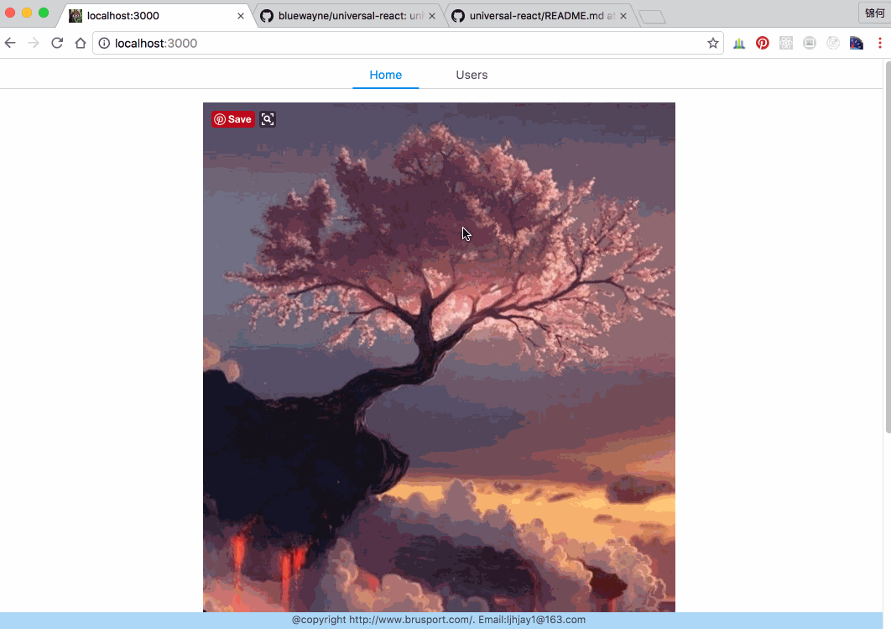

# universal-react

# React Redux Universal HMR Example

---

## technologies involved in the project:

* [Universal](https://medium.com/@mjackson/universal-javascript-4761051b7ae9) rendering
* Both client and server make calls to load data from separate API server
* [React](https://github.com/facebook/react)
* [React Router](https://github.com/rackt/react-router)
* [Express](http://expressjs.com)
* [Babel](http://babeljs.io) for ES6 and ES7 magic
* [Webpack](http://webpack.github.io) for bundling
* [Webpack Dev Middleware](http://webpack.github.io/docs/webpack-dev-middleware.html)
* [Webpack Hot Middleware](https://github.com/glenjamin/webpack-hot-middleware)
* [Redux](https://github.com/rackt/redux)'s futuristic [Flux](https://facebook.github.io/react/blog/2014/05/06/flux.html) implementation
* [Redux Dev Tools](https://github.com/gaearon/redux-devtools) for next generation DX (developer experience). Watch [Dan Abramov's talk](https://www.youtube.com/watch?v=xsSnOQynTHs).
* [React Router Redux](https://github.com/reactjs/react-router-redux) Redux/React Router bindings.
* [style-loader](https://github.com/webpack/style-loader), [sass-loader](https://github.com/jtangelder/sass-loader) and [less-loader](https://github.com/webpack/less-loader) to allow import of stylesheets in plain css, sass and less,
* [universal-webpack](https://github.com/halt-hammerzeit/universal-webpack) Isomorphic Webpack: both on client and server
* [ant design](https://ant.design/index-cn) a pretty excellent UI language for REACT

## Installation

```bash
npm install
```

## Running Dev Server

```bash
npm run dev
```




版权所有（c）2016 @ bruce liu <ljhjay1@163.com>

仅供学习参考，不得用于商业目的.